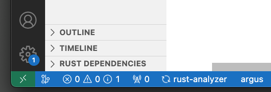

# Example 1, a simple workspace

This first example will walk through how to use Argus to debug a simple trait error. It's meant as an introduction to Argus, the notation and iconography it uses, and the basics to track down a simple error. This uses the [Media Workspace](https://github.com/cognitive-engineering-lab/argus/tree/examples/media) available in the Argus `examples` repository. It's best to follow along with the workspace open locally as not all code will be provided in the description.

## Your task: a media archiver

You work at a local library and are in charge of digitally archiving historical works. The clever Rustacian you are, you've built a small script that will *summarize* said works and publish them to the local archive. There are many types of media you'd like to summarize, `NewsArticle`s, `Book`s, and `Play`s, just to name a few. The common interface for summarizing a work is the trait: `Summary`.

```rust
pub trait Summary {
  fn summarize(&self) -> String;
}
```

To start your script, you first create a connection to your local web archive:

```rust
let mut archive = WebArchive::new(
    "https://library.example.gov", // domain
    "best-libarian", // username
    "b00k5!" // password 
);
```

You can then register *summarizable* media on the archive connection:

```rust
archive.register(NewsArticle::new(
    "Penguins win the Stanley Cup Championship!",
    "The Pittsburgh Penguins once again are the best hockey team in the NHL.",
));
```

To make your life easier, you've made some interface decisions that allow you to group related media together, potentially allowing for faster archiving.

```rust 
archive.register(vec![
    NewsArticle::new("Queen Elizabeth II", "The British Monarch is a figurehead of the British people."),
    NewsArticle::new("Queen Elizabeth II dies at 96", "The British Monarch has passed away."),
    NewsArticle::new("Thousands pay Tribute as Britain Says Final Farewell to Its Queen", "More than 100 world leaders and dignitaries are expected to attend the funeral of Queen Elizabeth II."),
]);
```

Easy! The above was achieved by using a *parameterized impl* block: `impl<T: Summary> Summary for Vec<T> ...`, the parameterization refers to the type parameter `T`. Sadly, as you compile your full script the Rust compiler complains! Providing this error.

```text
error[E0277]: the trait bound `&str: Summary` is not satisfied
   --> src/main.rs:34:6
    |
33  |   archive.register(
    |           -------- required by a bound introduced by this call
34  |     ("William Shakespeare", vec![
    |      ^^^^^^^^^^^^^^^^^^^^^ the trait `Summary` is not implemented for `&str`
```

"Why does `&str` need to implement the `Summary` trait?" Puzzled, you install Argus and open your workspace --- 

## Argus to the rescue

Argus works in Rust workspaces. On open, Argus will automatically start analyzing your files. To open the Argus *inspector*, you can click the Argus item in the VSCode toolbar.



Alternatively, you can run the "Argus: Inspect Workspace" command from the command pallet. You now have an inspection window open besides your active editor.

<video controls>
  <source src="assets/simple-workspace/expressions-in-body.mp4" type="video/mp4" />
</video>


The top-level of the Argus inspector is a *list of bodies*. Bodies are usually functions, in this case you see `main (1)` because there's only one function, `main` and it has a single trait error. Under each body is a *list of expressions*, these expressions spawned some trait obligations for the compiler to prove. Obligations are simple questions, like "*is type T sized?*", or in other words, does the obligation `T: Sized` hold? In the case of our simple script, rustc wants to know if the type `(&str, Vec<Play>)` implements `Summary`. The Argus inspector maps each expression back to its source position in your workspace, highlighting the code in the editor as seen in the above animation.

<video controls>
  <source src="assets/simple-workspace/jump-to-error.mp4" type="video/mp4" />
</video>

Files typically have many bodies and each body in turn has many expressions! But Argus wants to make your life easier by automatically jumping to the failed obligations in the inspector window. In the editor Argus will indicate — albeit, a touch aggressively at times — errors, or sources of ambiguity and provide a `Debug error` link.

<video controls>
  <source src="assets/simple-workspace/open-to-tree.mp4" type="video/mp4" />
</video>

Rust goes through a long process to evaluate obligations, this is referred to as *trait solving*. Put simply, Rust searches for an impl block that satisfies the trait bound. As seen previously, impl blocks can rely on other impl block, and while evaluating an obligation Rust builds up a tree: each node holds an obligation, and under that obligation is a set of "impl blocks" that could potentially provide an implementation for the trait. When an error occurs, the Argus inspector will (by default) invert this tree, showing you the obligations that failed first. Here you see that `&str: Summary` is **unsatisfiable**, that means Rust knows it to not be true!

Wait, how did Rust come to ask whether `&str` implements `Serialize`? By following the path from the failure to the *root obligation*, you see that there exists an impl block for tuples of types, but each tuple component needs to implement `Summary`.

<video controls>
  <source src="assets/simple-workspace/impl-block.mp4" type="video/mp4" />
</video>

Shown in the above animation is this impl block. The Rust type-system can at times by verbose, for this reason Argus will hide unnecessary information behind a toggle element. Included in this list is generic type parameters, and where clause constraints. You have now identified why the code doesn't compile and the exact path rustc took to get here. As previously stated, Argus defaults to showing you the inverted tree, or the *Bottom Up* view as it's labeled. It can sometimes be nice to see the tree *Top Down*. Argus can do that too!

<video controls>
  <source src="assets/simple-workspace/top-down.mp4" type="video/mp4" />
</video>

In the top-down view you see that rustc also evaluated whether the second tuple element, `Vec<Play>`, implements `Summary`. Which it does. One last trick up Argus' sleeve is to build an SVG of the generated tree. An SVG can be built at each level by clicking the  icon. How to download these SVGs for safe-keeping is deferred to a later chapter.

## Fixing the error

All this talk about obligations, trees, and impl blocks, but our archiving script still doesn't compile. Argh! Argus was able to get us to understand the specific reason as to *why* the code doesn't compile, but can't (yet) propose fixes for the error. Since we know that both tuple elements must implement `Summary`, understanding what core types implement this trait is a good starting point.

> If this system of traits weren't so contrived, now would be a good time to open the documentation for the `Summary` trait. For future reference, this information is found on the respective trait's documentation page under **implementations**.

Looking through the documentation you learn that the types: `Play`, `Book`, `NewsArticle`, and `String` all implement `Summary`. Herein lies the answer, you can convert the `&str` to an owned `String`, preserving intent of the program and satisfying the required trait bound. Huzzah! Head back to the editor to make sure this fix works:

<video controls>
  <source src="assets/simple-workspace/fix-error.mp4" type="video/mp4" />
</video>

No more angry red squiggles, the error count in the file dropped to zero, and you can finally get back to archiving those important pieces of history.

## A note on diagnostics

Credit where credit is due, for this specific trait error rustc does a good job at telling you what went wrong. I previously hid the full error message to make this trivial example a little less trivial.

```text 
error[E0277]: the trait bound `&str: Summary` is not satisfied
   --> src/main.rs:34:6
    |
33  |   archive.register(
    |           -------- required by a bound introduced by this call
34  |     ("William Shakespeare", vec![
    |      ^^^^^^^^^^^^^^^^^^^^^ the trait `Summary` is not implemented for `&str`
    |
    = help: the trait `Summary` is implemented for `String`
note: required for `(&str, Vec<media::Play>)` to implement `Summary`
   --> src/media.rs:103:30
    |
103 | impl<T: Summary, U: Summary> Summary for (T, U) {
    |         -------              ^^^^^^^     ^^^^^^
    |         |
    |         unsatisfied trait bound introduced here
note: required by a bound in `media::WebArchive::register`
   --> src/media.rs:12:22
    |
12  |   pub fn register<T: Summary>(&mut self, item: T) {
    |                      ^^^^^^^ required by this bound in `WebArchive::register`
```

Not only does rustc provide the root cause of the error, it also tells you which impl block introduced the extra obligation. This diagnostic even goes *one step further* by telling you that `Summary` is implemented for `String`!

What's Argus really for? As soon as the [next example](debug-bevy.md) you'll see that Rust can't always pin down why a trait bound was unsatisfied. In worst case the compiler will even [stack overflow](debug-stack-overflow.md)! Leaving you to some tricky ad-hoc debugging. Argus aims to make all these failures transparent and hopefully provide as specific an error message as possible. 

