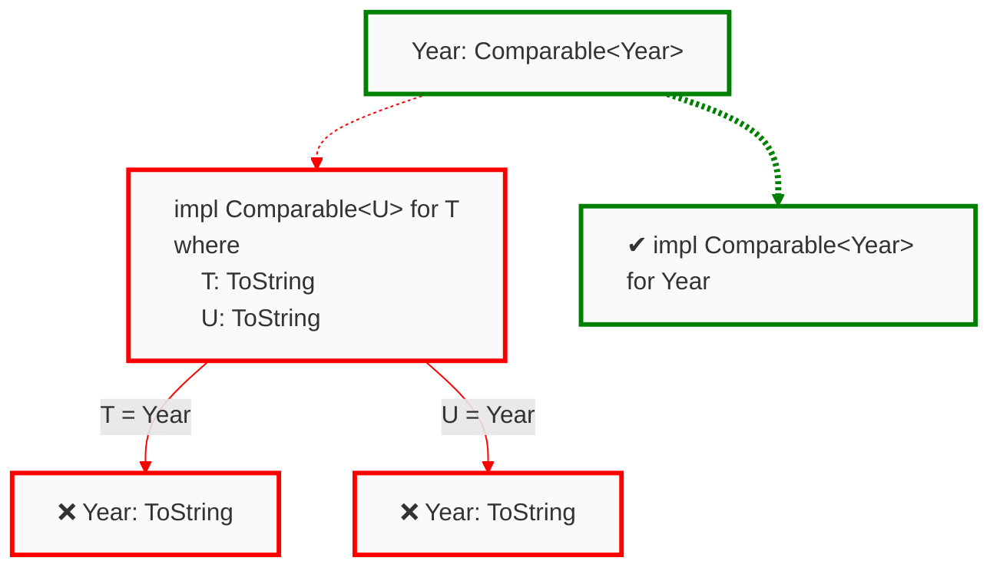
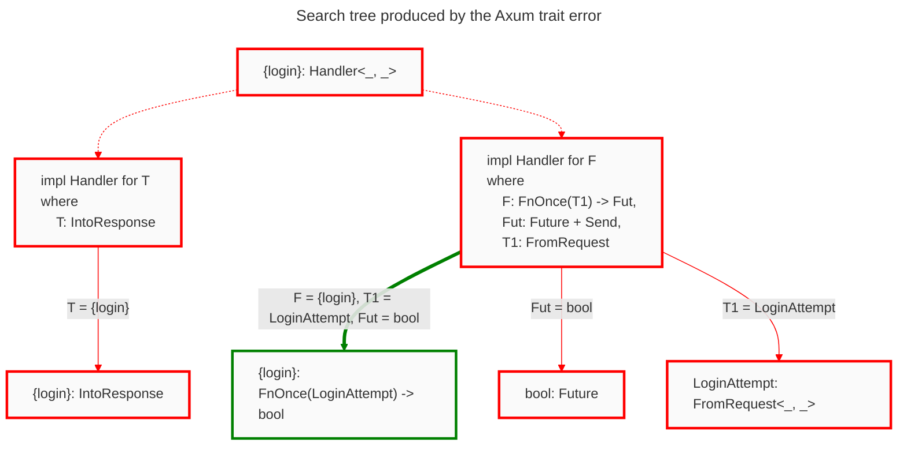
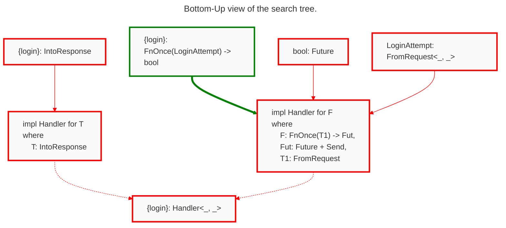

# Trait Debugging 101

Traits are a pervasive language feature in Rust: Copying, printing, indexing, multiplying, and more common operations use the Rust trait system. As developers use more of the language, and utilize the many available published crates, they will inevitably encounter more traits. Popular crates in the Rust ecosystem use traits to achieve richer type safety, such as the Diesel crate that uses traits to turn invalid SQL queries into type errors. Impressive!

Static checks and type safety is great, but compiler errors can become increasingly complex alongside the types and traits you use. This guide serves to teach "trait debugging" in Rust, using a new tool, Argus, developed by the [Cognitive Engineering Lab](https://cel.cs.brown.edu/) at Brown University.

```admonish info 
If you're already familiar with the process of trait solving, [click here](#your-first-web-server) to dive straight into start debugging.

If you're **participating** in a user study with us, please read this section.
```

Traits define units of *shared behavior* and serve a similar purpose as Java interfaces. In Java, you would declare an interface with a given name, and list functions the trait implementors must provide. Below we define a `Year`, simply a wrapper around an integer, and implement `Comparable<Year>` for a `Year`. This means we can compare years to other years, nothing else.

```java
interface Comparable<T> {
  int compareTo(T o);
}

class Year implements Comparable<Year> {
  private int rawYear;

  int compareTo(Year that) {
    // ... implementation elided ...
  }
}
```

The equivalent Rust program looks similar, though one difference is how we declare `Year` an implementor of `Comparable<Year>`.

```rust
trait Comparable<T> {
  fn compare_to(&self, o: &T) -> i32;
}

struct Year {
  raw_year: i32,
}

impl Comparable<Year> for Year {
  fn compare_to(&self, o: &Year) -> i32 {
    // ... implementation elided ... 
  }
}
```

Notice that we *separate* the trait implementation and struct definition. In Java we both defined the class `Year` and declared it an implementor at the same time. In Rust we defined the struct `Year` and separately provided its `Comparable<Year>` implementation. The separation between definition and trait implementation means that for the compiler to answer the question "Does `Year` implement `Comparable<Year>`?" it must *search* for the relevant impl block. If no block exists, or if multiple blocks exist, this is a type error. The component responsible for finding trait implementations is the *trait solver.*

## An Overview of The Trait Solver

The trait solver has a single goal: respond to questions about types implementing traits. These so called "questions" come from trait bounds, which look like this in Rust: `Year: Comparable<Year>`. This trait bound says that `Year` must implement `Comparable<Year>`. In this post trait bounds read "does `Year` implement `Comparable<Year>`?" We do this because the trait solver is only responsible for answering questions, not determining if an 'No' answer becomes a type error. Here's some examples of questions the trait solver can get, and how the solver would respond.

- Does `Year: Comparable<String>` hold? *Response: No*

- Does `Year: Sized` hold? *Response: Yes*

- Does `Year: Comparable<Year>` hold? *Response: Yes*

- Does `Year: Comparable<T>` hold? *Response: Maybe, if `T = Year`*

If the response is *maybe*, as in the third example above, the compiler will perform extra inference to check if `T = Year`, if it isn't, then it may become a type error. Maybe responses are out of scope for this tutorial so we won't mention them again. After reading this section you should know how the Rust trait solver determines its response to a question.

### A simple algorithm for trait solving

The steps to respond to `Ty: Trait` proceed as follows.

1. For each implementation for `Trait`

   ```rust 
   impl Trait for T
   where
     Constraint_0,
     Constraint_1, 
     ...
     Constraint_N,
   ```
   
   if `T` and `Ty` *unify*, proceed, otherwise respond no. 
   
   ```admonish note
   You may not know what we mean with "if they unify," so let's go over some examples. Two types unify in the trait solver if we can instantiate type variables such that they are equivalent.
   
   - `String` and `Year` don't unify
   - `T` and `Year` unify because `T` is a type variable. So if `T = Year`, then they're equivalent
   - `Vec<String>` and `Vec<T>` unify if `T = String`
   - `Vec<U>` and `Vec<T>` unify if `U = T`
   ```
   
2. For each `Constrint_i`, restart the process with `Constrint_i` as the question. Respond with *yes* if all constraint responses are *yes*.
   
3. Respond with *yes* if exactly one impl block responded with *yes*.

Notice that these steps are recursive. When checking a where clause constraint the trait solver calls itself. The prosaic version is a bit nebulous, let's consider the diagramatic version instead. Consider the `Comparable` trait, we shall extend the previous program with one more impl block.

```rust 
trait Comparable<T> {
  fn compare_to(&self, o: &T) -> i32;
}

struct Year {
  raw_year: i32,
}

// We can compare Years to Years
impl Comparable<Year> for Year {
  fn compare_to(&self, o: &Year) -> i32 {
    // ... implementation elided ... 
  }
}

// NEW: we can compare two values IFF 
// they can both be converted to strings
impl<T, U> Comparable<U> for T 
where 
  T: ToString,
  U: ToString,
{
  fn compare_to(&self, o: &U) -> i32 {
    // ... implementation elided ... 
  }
}

```

Let's consider how the trait solver would go about responding to the question `Year: Comparable<Year>`.



Dotted lines represent an **Or** relationship between parent and child. That is, exactly one of the child blocks needs to respond with 'yes.' We see these lines coming from the root question and extending to the impl blocks. Impl blocks always form an Or relationship with their parents. This models step 3 in the listed algorithm because one of the impl blocks must match, no more and no fewer.

Solid lines represent **And** relationships between parent and child. That is, every one of the child blocks needs to respond with 'yes.' We see these lines coming from impl blocks and extending to the constraints. Constraints always form an And relationship with their parent impl block. Or rather, all constraints in a where clause must hold.

```admonish faq
**Why does the trait solver check the impl block for `T` when there exists one directly for `Year`?**

The trait solver must consider all potentially matching impl blocks. Because `T` unifies with `Year`, the trait solver must check this block as well. Remember, if multiple impls work then this *is also* an error: ambiguous trait usage. Exactly one impl block must match for there to be a success.
```

A neat pattern to observe is that a question always has an impl block as a child, with a dotted line. We can never have two questions in a row; you shouldn't answer a question with a question! Impl blocks always have a question as a child, with a solid line. If you follow a specific path in the tree the pattern of relationships will be "Or, And, Or, And, Or, And, …"

The tree diagram above actually has a name, it's called the *search tree*. Search trees represent the execution of the trait solver! Just as you may have traced your own programs to debug strange behavior, we can trace the trait solver to help us understand why a particular outcome occurred. Search trees are the core data structure used in the Argus trait debugger, let's size up to a real example and see how we can use Argus to do some trait debugging.


## Your First Web Server

Axum is a popular Rust web application framework and we're going to use it to build a web server. Here's our starting code.

```rust,ignore,compile_fail
{{#include ../../examples/hello-server/src/main.rs:4:}}
```

Unfortunately, our server does not work! Rust provides the following error diagnostic

```text 
error[E0277]: the trait bound `fn(LoginAttempt) -> bool {login}: Handler<_, _>` is not satisfied
   --> src/main.rs:14:49
    |
14  |     let app = Router::new().route("/login", get(login));
    |                                             --- ^^^^^ the trait `Handler<_, _>` is not implemented for fn item `fn(LoginAttempt) -> bool {login}`            
    |                                             |
    |                                             required by a bound introduced by this call
    |
    = help: the following other types implement trait `Handler<T, S>`:
              <Layered<L, H, T, S> as Handler<T, S>>
              <MethodRouter<S> as Handler<(), S>>
note: required by a bound in `axum::routing::get`
```

The above diagnostic, in a long-winded way, tells us that the function `login` does not implement `Handler`. As the authors, we *intended* to use `login` as a handler, so I'm stumped why it doesn't. 

```admonish note
Going forward we will write `{login}` to abbreviate the type of `login`, `fn(LoginAttempt) -> bool`, which is far too verbose to repeat over and over.
```

When the compiler diagnostic says "trait `Bleh` is not implemented for type `Blah`", that's a great opportunity to use Argus.

<!--
If you're following along locally, open the provided crate in VS Code (or an Argus-compatible editor of choice) and let's get started.  
-->

## Through the Search Tree

The diagnostic from rustc isn't totally useless; we learned that the type `fn(LoginAttempt) -> bool`, the signature of `login`, should implement the Axum trait `Handler`. Additionally, we know the call `get(login)` introduced the bound. Both pieces of information help us get started, but fail to answer why `login` *doesn't* implement `Handler`. Argus helps debug these types of trait errors by providing an interactive interface for the search tree.

````admonish example
Here's an illustrative diagram of the Axum-error search tree. Argus provides the search tree in a different format, similar to a directory tree, as you shall see later.


> We elide trivial bounds to declutter the diagram. Don't panic if you open the Argus panel and see some bounds not shown here.

Traversing the tree from root to leaf is what's referred to as "Top-Down" in the Argus extension. This view represents the full search tree, in other words, *how* the trait solver responded to the query. 
````

Notice that the Rust compiler diagnostic mentions the *root question*, `{login}: Handler<_, _>`, instead of the failing nodes at the tree leaves. The compiler is conservative, when presented with multiple failures in different impls, it defaults to reporting their parent. In the diagram there are two potentially matching impl blocks. There's one for a function with a single argument, and there's one for things that implement `IntoResponse` directly (i.e., static responses that don't need input). Because there's more than one potentially matching impl block, Rust can't decide which is the actual error.

Now let's walk through the search tree as presented in Argus' Top-Down view.


Highlighted at the top in orange is the search tree root. Argus represents the search tree in a directory view sort of way. The nodes are on each line, you expand the node's children by clicking. Notice how we still use solid and dotted lines to represent the parent child relationship, they're just to the left of the node instead an arrow connecting two bubbles.

The trait solver finds an appropriate impl block that matches the initial trait bound ([RustDoc link](https://docs.rs/axum/latest/axum/handler/trait.Handler.html#impl-Handler%3C(M,+T1),+S%3E-for-F))---highlighted below in green.


In order to use this impl block to satisfy the root trait bound, `{login}: Handler<_, _>`, the trait solver needs to satisfy all of the conditions in the where clause. Here are the steps it performs.

1. `F` unifies with `fn(LoginAttempt) -> bool`. 

2. Does `F` implement the trait `FnOnce(T1) -> Fut`? Yes, it does, we said 

    ```rust,ignore 
    F = fn(LoginAttempt) -> bool
    ```

    The type parameters `T1` and `Fut` unify with `LoginAttempt` and `bool`. (The bounds `Clone`, `Send`, and `'static` are also checked successfully.)

3. Does `Fut` implement `Future`? Hmmmm, no it doesn't. In step 2 we said that `Fut = bool`, but booleans aren't futures.

This failing bound tells us that the output of the function needs to be a future. Argh, we forgot to make the handler function asynchronous! What a silly mistake. However, before we jump back to our code and fix the issue, let's reflect on the Argus interface and see how we could have reached this same conclusion faster.


The screenshots included so far of the trait search tree are from the Top-Down view in Argus. This means we view the search just as Rust performed it: We started at the root question `{login}: Handler<_, _>`, descended into the impl blocks, and found the failing where-clause in a tree leaf. This failing leaf is highlighted in the above image in red. There's a second failing bound, but we'll come back to that in the next section. The insight is that errors are *leaves* in the search tree, so the Top-Down view doesn't show you the errors first but rather the full trait solving process.

What if you want to see the errors first? Lucky for you, Argus provides a second view of the tree called the Bottom-Up view. The Bottom-Up view starts at the error leaves, and expanding node children traverses up the tree towards the root. This view prioritizes showing you errors. Below demonstrates the Bottom-Up view.

````admonish example
The Bottom-Up view is the *inverted* search tree. You start at the leaves and traverse to the root. Here's the bottom-up version of the Axum error search tree.



Argus sorts the failing leaves in the Bottom-Up view by which are "most-likely" the root cause of the error. No tool is perfect, and Argus can be wrong! If you click on "Other failures," which appears below the first shown failure, Argus provides you the full list of failures.
````


<video controls>
  <source alt="Bottom-Up Argus view" src="assets/axum-hello-server/bottom-up-start.mp4" type="video/mp4" />
</video>


The above demonstrates that Argus identifies `bool: Future` as a root cause of the overall failure, but also the second failure `LoginAttempt: FromRequestParts<_, _>`. The note icon in the Bottom-Up view indicates that the two failures must be resolved together.

## Fixing Trait Bounds with Argus

<video controls>
  <source alt="Fix Future and IntoResponse" src="assets/axum-hello-server/async-fix-response.mp4" type="video/mp4" />
</video>

It turns out there are a lot of problems with our handler. Above shows that after marking the `login` function asynchronous, the bound `bool: IntoResponse` remains unsatisfied. This happened because the associated type `Output` of the `Future`, in this case our boolean, needs to implement `IntoResponse`. Some Argus features demonstrated that you may have missed.

1. We expand the Bottom Up view to see the lineage of impl blocks traversed to arrive at the failure. In this case there was only one between the root bound and the failing leaf, but the constraints in the where clause show the bound's origin.

2. To fix the `IntoResponse` bound we looked at all implementors of the trait. The list icon next to a tree node shows all impl blocks for the trait. Going through the list we saw the type `Json<T>` that satisfies our needs while preserving code intent.

```admonish note 
The list of trait implementors is equivalent to what you'd find in Rust documentation. See for yourself on the [`IntoResponse` documentation](https://docs.rs/axum/latest/axum/response/trait.IntoResponse.html#foreign-impls). Rust documentation makes a distinction between "implementations on foreign types" and "implementors," Argus lists both kinds of impl block together.
```

Moving forward let's finally fix the last failing bound and get the code to type check.

<video controls>
  <source alt="Finished debugging" src="assets/axum-hello-server/axum-type-checks.mp4" type="video/mp4" />
</video>

The above video contains a lot of information. Let's break down what happened.

1. We look through the implementors of `FromRequestParts`; this being the Argus-identified. However no impl block seemed to preserve my intent of extracting a `LoginAttempt` from request headers. It is a vague to say "nothing seemed right," and of course fixing a type error may require some familiarity with the crate you're using or the domain in which you're working.

2. Implementing `FromRequestParts` doesn't seem right, but we haven't checked what introduced the bound. Expanding the Bottom Up view reveals the bound `FromRequest` was first a constraint to implement `Handler`, and that `FromRequestParts` is an attempt to satisfy the `FromRequest` bound. Here's how that relationship looks in the Argus Top-Down view.
    
    What happened is the impl block 
    
    ```
    impl<S, T> FromRequest<S, ViaParts> for T ...
    ``` 
    
    unified `T` and `LoginAttempt` leading Argus to believe that `FromRequestParts` is the failing bound, but if we can satisfy `LoginAttempt: FromRequest<_, _>` this also fixes the trait error.
  
3. We look through the list of implementors for `FromRequest`. It's here we find that `Json` types implement `FromRequest`.

4. We fix the last failing bound, `LoginAttempt: Deserialize`, by deriving `Deserialize` for `LoginAttempt`.

Finally, after all of these errors, we have a type correct program. All of this work to get a type-correct program, you can use your free time to implement the actual functionality if you wish.

# Wrapping up

In this section we covered quite a bit of ground---let's recap quickly.

Rust uses a mechanism called traits to define units of shared behavior. We implement traits for types with impl blocks.

The *trait solver* searches through available impl blocks to determine if a given type implements a specified trait. Tracing the steps made by the trait solver is what we call the *search tree,* the core data structure exposed by the Argus IDE extension.

The Argus interface shows the search tree either Top-Down or Bottom-Up. The Top-Down view is the search tree as generated by the trait solver. The Bottom-Up view inverts the search tree and traverses the tree from leaves to root. The list icon next to a node shows all impl blocks for the trait in that node.

In the next chapter we'll see how to debug a Diesel error and show off a more features of Argus.
