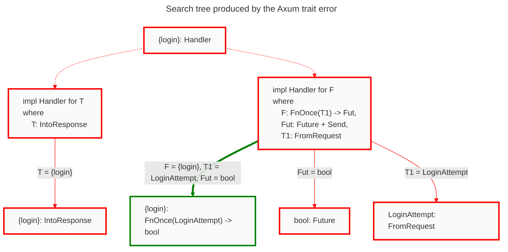
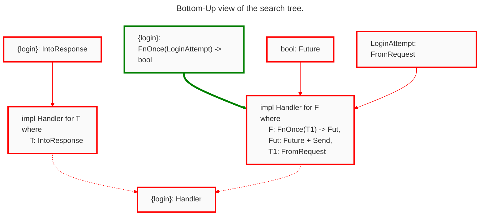

# Trait Debugging 101

Traits are a pervasive language feature in Rust: Copying, printing, indexing, multiplying, and more common operations use the Rust trait system. As you use more of the language, and utilize the numerous published crates, you will inevitably encounter more traits. Popular crates in the Rust ecosystem use traits to achieve strong type safety, such as the Diesel crate that relies on traits to turn invalid SQL queries into type errors. Impressive!

Unfortunately, traits also obfuscate type errors. Compiler diagnostics become increasingly complex alongside the types and traits used. This guide demonstrates *trait debugging* in Rust using a new tool, Argus, developed by the [Cognitive Engineering Lab](https://cel.cs.brown.edu/) at Brown University.

## Your First Web Server

[Axum](https://docs.rs/axum/latest/axum/) is a popular Rust web application framework, a great example of how traits can obfuscate type errors. We will use Axum to build a web server, and Argus to debug the trait errors; here's our starting code.

```rust,ignore,compile_fail
{{#include ../../examples/hello-server/src/main.rs:4:}}
```

Oh no, our server doesn't type check. Surely, the error diagnostic will tell us why---

```text 
error[E0277]: the trait bound `fn(LoginAttempt) -> bool {login}: Handler<_, _>` is not satisfied
   --> src/main.rs:14:49
    |
14  |     let app = Router::new().route("/login", get(login));
    |                                             --- ^^^^^ the trait `Handler<_, _>` is not implemented for fn item `fn(LoginAttempt) -> bool {login}`            
    |                                             |
    |                                             required by a bound introduced by this call
    |
    = help: the following other types implement trait `Handler<T, S>`:
              <Layered<L, H, T, S> as Handler<T, S>>
              <MethodRouter<S> as Handler<(), S>>
note: required by a bound in `axum::routing::get`
```

in a long-winded way the diagnostic has said "`login` does not implement `Handler`." But as the authors we *intended* for `login` to be a handler. The diagnostic hasn't provided much specific information as to why the code doesn't type check.

```admonish note
Going forward we will write `{login}` to abbreviate the type of `login`, `fn(LoginAttempt) -> bool`, which is far too verbose to repeat over and over.
```

When the error diagnostic says "trait bound `Bleh` is not satisfied", it's a great opportunity to use Argus.

## Down the Search Tree

In Rust we write type definitions and trait implementations separately---we refer to trait implementations as "impl blocks." The inner compiler component called the *trait solver* is responsible for answering queries like "Does `{login}` implement `Handler`?" such queries appear as trait bounds in the source code. The trait solver searches through the impl blocks trying to find whether or not the trait bound holds.

In this post we will be using the *search tree* a data structure produced by the trait solver that describes how it searched impl blocks, and why---or why not---a particular trait bound holds.

Here's an illustrative diagram of the Axum-error search tree. Argus provides the search tree in a different format, similar to a directory tree, as you shall see further on.



```admonish note 
We elided trivial bounds to declutter the above diagram. Don't panic if you open the Argus panel and see some bounds not shown here.
```

Dotted lines represent an **Or** relationship between parent and child. That is, exactly one of the child blocks needs to hold---outlined in green. We see dotted lines coming from the root bound and extending to the impl blocks. Impl blocks always form an Or relationship with their parent.

Solid lines represent **And** relationships between parent and child. That is, every one of the child blocks needs to hold. We see solid lines coming from impl blocks and extending to the nested constraints. Constraints always form an And relationship with their parent impl block.

Traversing the tree from root to leaf is what's referred to as "Top-Down" in the Argus extension. This view represents the full search tree, in other words, *how* the trait solver responded to the query. 

Comparing the search tree to the error diagnostic is curious: Why did the error diagnostic mention the *root bound*, `{login}: Handler<_, _>`, instead of a more specific failing bound at the tree leaves? The compilers job is to take the search tree and tell you something useful about why the trait bound failed---but Rust can't tell you everything, because there's simply too much information. So it picks the most specific failure it can, which in this case is the root node. Rust doesn't know which of the two impl blocks you *intended* to use and it won't speculate on your behalf.

We developed Argus so you can identify the *specific failures* that led to a particular trait error; Argus can provide more specific details on a trait error than Rust is willing to summarize in a single text-based diagnostic message. Let's walk through the search tree as presented in Argus' Top-Down view.


Highlighted at the top in orange is the search tree root. Argus represents the search tree in a directory view sort of way, so the orange node is equivalent to the tree root node in the illustrative diagram. In the Argus tree you expand the nodes' children by clicking on the line. Notice how we still use solid and dotted lines to represent the parent child relationship, they now appear to the left of the node.


Above we show one branch in the search tree for the function handler impl block---highlighted in green. In this branch we unify the type variables

```text
F = fn(LoginAttempt) -> bool
T1 = LoginAttempt
Fut = bool
```

and add the where-clause constraints as children of the impl block. Notice the constraint `Fut: Future`, given that `Fut = bool`, the constraint requires that booleans be futures, but they aren't! Argh, we forgot to make the handler function asynchronous! What a silly mistake. Before we jump back to our code and fix the issue, let's reflect on the Argus interface and see how we can reach the same conclusion faster.


The screenshots included so far of the trait search tree are from the Top-Down view in Argus. This means we view the search just as Rust performed it: We started at the root question `{login}: Handler<_, _>`, descended into the impl blocks, and found the failing where-clause in a tree leaf---highlighted in red. There's a second failing bound, but we'll come back to that in the next section. The insight is that errors are *leaves* in the search tree, so the Top-Down view doesn't prioritize showing you errors, but rather the full trait solving process.

## Up the Search Tree

What if you want to see the errors first? Argus provides a second view of the tree called the Bottom-Up view. The Bottom-Up view starts at the error leaves and expanding node children traverses up the tree towards the root. This view prioritizes showing you errors first.

The Bottom-Up view is the *inverted* search tree. You start at the leaves and traverse to the root. Here's the bottom-up version of the Axum error search tree.



Argus sorts the failing leaves in the Bottom-Up view by which are "most-likely" the root cause of the error. No tool is perfect, and Argus can be wrong! If you click on "Other failures," which appears below the first shown failure, Argus provides you a full list.

<video controls>
  <source alt="Bottom-Up Argus view" src="assets/axum-hello-server/bottom-up-start.mp4" type="video/mp4" />
</video>

The above demonstrates that Argus identifies `bool: Future` as a root cause of the overall failure in addition to the second failure: `LoginAttempt: FromRequestParts<_, _>`. The note icon in the Bottom-Up view indicates that the two failures must be resolved together if you want to us the function as a handler.

<video controls>
  <source alt="Fix Future and IntoResponse" src="assets/axum-hello-server/async-fix-response.mp4" type="video/mp4" />
</video>

```admonish note 
The list of trait implementors is equivalent to what you'd find in Rust documentation. See for yourself in the [`IntoResponse` documentation](https://docs.rs/axum/latest/axum/response/trait.IntoResponse.html#foreign-impls). Rust documentation makes a distinction between "implementations on foreign types" and "implementors," Argus lists both kinds of impl block together.
```

Moving forward let's finally fix the last failing bound and get the code to type check.

<video controls>
  <source alt="Finished debugging" src="assets/axum-hello-server/axum-type-checks.mp4" type="video/mp4" />
</video>

The above video contains a lot of information. We'll comment on the two key pieces of information.

1. We look through the implementors of `FromRequestParts`; this being the Argus-identified error, but no impl block seemed to preserve our intent of extracting a `LoginAttempt` from request headers. It's vague to say "nothing seemed right," and of course fixing a type error may require some familiarity with the crate you're using or the domain in which you're working.

2. Instead of implementing `FromRequestParts` it turns out we can also implement `FromRequest`. We determined this by expanding the Bottom-Up view to reveal that the bound `FromRequest` was first a constraint to implement `Handler`, and that `FromRequestParts` is an attempt to satisfy the `FromRequest` bound. Here's an annotated image of the Top-Down view to highlight the relationship between these two traits.
    

Finally, after all of these errors, we have a type correct program. All of this work to get a type-correct program, you can use your free time to implement the actual functionality if you wish.

# Wrapping up

Rust uses a mechanism called traits to define units of shared behavior. We implement traits for types with impl blocks.

The *trait solver* searches through available impl blocks to determine if a given type implements a specified trait. Tracing the steps made by the trait solver is what we call the *search tree,* the core data structure exposed by the Argus IDE extension.

The Argus interface shows the search tree either Top-Down or Bottom-Up. The Top-Down view is the search tree as generated by the trait solver. The Bottom-Up view inverts the search tree and traverses the tree from leaves to root. The list icon next to a node shows all impl blocks for the trait in that node.

In the next chapter we'll show off more features of Argus and debug a Diesel trait error.
