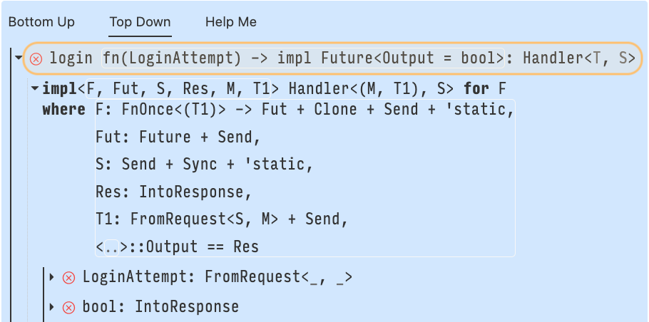

# Trait Debugging 101

Traits are a pervasive language feature in Rust: Copying, printing, indexing, multiplying, and more common operations use the Rust trait system. As developers use more of the language, and utilize the many available published crates, they will inevitably encounter more traits. Popular crates in the Rust ecosystem use traits to achieve richer type safety, such as the Diesel crate that uses traits to turn invalid SQL queries into type errors. Impressive!

Static checks and type safety is great, but compiler errors can become increasingly complex alongside the types and traits you use. This guide serves to teach "trait debugging" in Rust, using a new tool, Argus, developed by the Cognitive Engineering Lab at Brown University.

> If you're familiar with traits and just want to start debugging, [click here](#your-first-web-server).

Traits define units of *shared behavior* and serve a similar purpose as Java interfaces. In Java, you would declare an interface with a given name, and list some number of functions for which the interface implementors need to provide an implementation. Below is an example definition of a `Year`, simply a wrapper around an integer, that implements `Comparable<Year>`, meaning a year is only comparable to other years.

```java
interface Comparable<T> {
  int compareTo(T o);
}

class Year implements Comparable<Year> {
  private int raw_year;

  int compareTo(Year that) {
    // ... implementation elided ...
  }
}
```

The definition in Rust looks quite similar, though one difference is how we declare `Year` to be `Comparable`.

```rust
trait Comparable<T> {
  fn compare_to(&self, o: &T) -> i32;
}

struct Year {
  raw_year: i32;
}

impl Comparable<Year> for Year {
  fn compare_to(&self, o: &T) {
    // ... implementation elided ...
  }
}
```

Notice in Rust that the trait implementation and struct definition are *separate.* In the Java example we both defined the class `Year` and declared it an implementor using the one line `class Year implements Comparable<Year>`. In Rust, we defined the struct `Year`, and separately provided its implementation for the `Comparable<Year>` trait. This separation is something to keep in mind as you delve into traits, and as we shall see below, this separation is powerful, and with great power comes tricky debugging!

## Your First Web Server

To do some real debugging we should to use a real crate. Axum is a popular Rust web application framework and we're going to use it to build a web server. Here's some starting code for the server, if you want to follow along locally, which we recommend doing, the code is [available on GitHub](TODO).

```rust 
use axum::{routing::get, Router, body::Bytes};

struct LoginAttempt {
    user_id: u64,
    password: String,
}

fn login(attempt: LoginAttempt) -> bool {
    todo!()
}

#[tokio::main]
async fn main() {
    let app = Router::new().route("/login", get(login));

    let listener = tokio::net::TcpListener::bind("0.0.0.0:3000").await.unwrap();
    axum::serve(listener, app).await.unwrap();
}
```

Unfortunately, our server does not work! Compiling the above code results in the ambiguous error diagnostic

```text 
error[E0277]: the trait bound `fn(LoginAttempt) -> bool {login}: Handler<_, _>` is not satisfied
   --> src/main.rs:14:49
    |
14  |     let app = Router::new().route("/login", get(login));
    |                                             --- ^^^^^ the trait `Handler<_, _>` is not implemented for fn item `fn(LoginAttempt) -> bool {login}`            
    |                                             |
    |                                             required by a bound introduced by this call
    |
    = help: the following other types implement trait `Handler<T, S>`:
              <Layered<L, H, T, S> as Handler<T, S>>
              <MethodRouter<S> as Handler<(), S>>
note: required by a bound in `axum::routing::get`
```

The above diagnostic, in a long-winded way, is telling us that the function `login` does not implement `Handler`. As the authors, we *intended* to use `login` as a handler, so I'm stumped why it doesn't. Fortunately, Argus is coming to the rescue! If you're following along locally, open the provided crate in VS Code (or an Argus-compatible editor of choice) and let's get started.

## Through the Search Tree

The diagnostic from rustc isn't totally useless; we learned that the type `fn(LoginAttempt) -> bool`, the signature of `login`, should implement the Axum trait `Handler`. Additionally, we know that this bound was introduced by the call `get(login)`. This information is useful, but it fails to answer why `login` doesn't implement `Handler`.

To help us inspect the problem, we will look at the search tree produced by the Rust trait solver. The search tree is exposed in the Argus VS Code extension as the "Top-Down" view.



The trait search tree always starts with a trait bound, which we read like questions. For example `String: Display` reads "Does `String` implement `Display`?" In our case, that question is the same failing trait bound that appeared in the Rust error diagnostic, `fn(LoginAttempt) -> bool: Handler<_, _>`, and it's highlighted in orange in the above search tree. 

> For brevity we will abbreviate types of functions as `{login}: Handler<_, _>`, where `{login}` reads as "the type of `login`", which is in this case `fn(LoginAttempt) -> bool`.

For a type to implement a trait there must be a matching *implementation block*. Implementation blocks come in two flavors, non-parameterized implementations and parameterized implementations. 

Non-parametrized implementations such as 

```rust 
impl Display for String { /* ... */ }
```

have no type parameters. Notice there's no angle brackets after the `impl`. These types of implementations directly implement a trait for a type. The above example can be read like a statement, "`String` does implement `Display`."

Parameterized implementations such as

```rust
impl<T> Display for Vec<T> where T: Display { /* ... */ }
```

are parameterized by types, like the type parameter `T` in the above. Parameterized implementation blocks are powerful because they allow programmers to constrain the implementation with *where clauses*. For the small example of implementing `Display` for `Vec<T>`, the implementation block reads as "`Vec<T>` implements `Display` **IFF** `T` implements display." Unlike non-parameterized implementations, parameterized implementations aren't quite definitive statements because they are qualified. Not every vector implements `Display`, only those whose elements implement display. Parameterized implementations are powerful because a trait can be implemented for a set of types, for example `Vec<String>, Vec<char>, Vec<i32>, ...`

Let's bring the conversation back to our problem. Rust finds an appropriate implementation block that matches the initial trait bound ([RustDoc link](https://docs.rs/axum/latest/axum/handler/trait.Handler.html#impl-Handler%3C(M,+T1),+S%3E-for-F)). This is highlighted below in green.


In order to use this implementation block to satisfy the root trait bound, `{login}: Handler<_, _>`, Rust now needs to satisfy all of the conditions in the where clause. The trait solver performs the following steps following the list of constraints in the where clause.

1. `F` is `fn(LoginAttempt) -> bool`, does this implement the trait `FnOnce(T1) -> Fut`? Yes, it does, but only if the type parameters `T1` and `Fut` are equal to `LoginAttempt` and `bool`. Rust then unifies `T1 = LoginAttempt` and `Fut = bool`.

2. The bounds `Send`, `Sync`, and `'static` are checked for `F` and they succeed.

3. Does `Fut` implement `Future`? Hmmm, well, no it doesn't. In step 1 we said that `Fut = bool`, but booleans aren't futures.

This failing bound tells us that the output of the function needs to be a future. Argh, 🤦 we forgot to make the handler function asynchronous! What a silly mistake. However, before we jump back to our code and fix the issue, let's reflect on the Argus interface and see how we could have reached this same conclusion faster.


The screenshots included so far of the trait search tree are from the Top-Down view in Argus. This means we view the search just as Rust performed it: We started at the root question `{login}: Handler<_, _>`, descended into the implementation blocks, and found the failing where-clause in a tree leaf. This failing leaf is highlighted in the above image in red. There's also another failing trait bound, `LoginAttempt: FromRequest<_, _>`, which we'll come back to in a moment. The insight is that all of the errors reside in the search tree *leaves,* so the Top-Down view doesn't show you the errors first but rather the process Rust went through to find the errors. The process is helpful to know which implementation blocks and trait bounds were involved from tree root to failing leaf.

What if you want to see the errors first? Lucky for you, Argus provides a second view of the tree called the Bottom-Up view. The Bottom-Up view starts at the error leaves, and lets you traverse up in the tree towards the root. This view prioritizes showing you errors. Below is what the Bottom-Up view looks like for the failing bound `{login}: Handler<_, _>`, and remember the function is still not asynchronous.


<video controls>
  <source alt="Bottom-Up Argus view" src="assets/axum-hello-server/bottom-up-start.mp4" type="video/mp4" />
</video>

The above video demonstrates that Argus identifies `bool: Future` as a root cause of the overall failure, but also the second failure `LoginAttempt: FromRequest<_, _>`. Argus also indicates that these two failing trait bounds need to be resolved *together* to satisfy the root bound, `{login}: Handler<_, _>`. We'll first make the function `login` asynchronous, now let's get on to fixing the second failing bound: `{login}: Handler<_, _>`.

## Fixing Trait Bounds with Argus


