# Trait Debugging 101

Traits are a pervasive language feature in Rust: Copying, printing, indexing, multiplying, and more common operations use the Rust trait system. As developers use more of the language, and utilize the many available published crates, they will inevitably encounter more traits. Popular crates in the Rust ecosystem use traits to achieve richer type safety, such as the Diesel crate that uses traits to turn invalid SQL queries into type errors. Impressive!

Static checks and type safety is great, but compiler errors can become increasingly complex alongside the types and traits you use. This guide serves to teach "trait debugging" in Rust, using a new tool, Argus, developed by the Cognitive Engineering Lab at Brown University.

```admonish info 
If you're already familiar with the process of trait solving, [click here](#your-first-web-server) to dive straight into start debugging.

However if you're **participating** in a user study with us, please read this section.
```

Traits define units of *shared behavior* and serve a similar purpose as Java interfaces. In Java, you would declare an interface with a given name, and list some number of functions for which the interface implementors need to provide an implementation. Below is an example definition of a `Year`, simply a wrapper around an integer, that implements `Comparable<Year>`, meaning a year is only comparable to other years.

```java
interface Comparable<T> {
  int compareTo(T o);
}

class Year implements Comparable<Year> {
  private int rawYear;

  int compareTo(Year that) {
    // ... implementation elided ...
  }
}
```

The definition in Rust looks quite similar, though one difference is how we declare `Year` to be `Comparable`.

```rust
trait Comparable<T> {
  fn compare_to(&self, o: &T) -> i32;
}

struct Year {
  raw_year: i32,
}

impl Comparable<Year> for Year {
  fn compare_to(&self, o: &Year) -> i32 {
    // ... implementation elided ... 
  }
}
```

Notice in Rust that the trait implementation and struct definition are *separate.* In the Java example we both defined the class `Year` and declared it an implementor using a single line. In Rust, we defined the struct `Year`, and separately provided its implementation for the `Comparable<Year>` trait. The separation between definition and trait implementation means that for the compiler to answer the question "Does `Year` implement `Comparable<Year>`?" it must *search* for the relevant implementation block. If no block exists, or if multiple blocks exist, this is a type error. We call The component inside the compiler responsible for this search the *trait solver*.

## An Overview of The Trait Solver

The trait solver has a single goal: respond to questions about types implementing traits. These so called "questions" come from trait bounds, the Rust syntax looks like this: `Year: Comparable<Year>`. This trait bound says that `Year` must implement `Comparable<Year>`. In this post we refer to bounds as questions, "does `Year` implement `Comparable<Year>`?" We do this because the trait solver is only responsible for answering questions, not determining if an 'No' answer becomes a type error. Here's some examples of questions the trait solver can get, and how the solver would respond.

- Does `Year: Comparable<String>` hold? *Response: No*

- Does `Year: Sized` hold? *Response: Yes*

- Does `Year: Comparable<Year>` hold? *Response: Yes*

- Does `Year: Comparable<T>` hold? *Response: Maybe, if `T = Year`*

If the response is *maybe*, as in the third example above, the compiler will perform extra inference to check if `T = Year`, if it isn't, then it may become a type error. After reading this section you should know how the Rust trait solver determines its response to a question.

### A simple algorithm for trait solving

The steps to respond for a question `Ty: Trait` proceed as follows.

1. Find all implementation blocks for `Trait`.

2. For all implementation blocks of the form 

   ```rust 
   impl Trait for T
   where
     Constraint_0,
     Constraint_1, 
     ...
     Constraint_N,
   ```
   
   if `T` and `Ty` *unify*, restart from (1) with the question `Constrint_i`. Respond with *yes* if all constraint responses are *yes*.
   
   You may not know what I mean with "if they unify," so let's go over some examples. Two types unify in the trait solver if we can instantiate type variables such that they are equivalent.
   
   - `String` and `Year` don't unify
   - `T` and `Year` unify because `T` is a type variable. So if `T = Year`, then they're equivalent
   - `Vec<String>` and `Vec<T>` unify if `T = String`
   - `Vec<U>` and `Vec<T>` unify if `U = T`
   
3. Respond with *yes* if exactly one implementation block responded with *yes*.

Notice that these steps are recursive. Checking the constrain from a where block starts the process over again, as if it were the original question. Listed in prose the process may seem confusing, but we think it's more enlightening as a diagram. Consider the `Comparable` trait, we'll extend the previous program with one more implementation block as shown below.

```rust 
trait Comparable<T> {
  fn compare_to(&self, o: &T) -> i32;
}

struct Year {
  raw_year: i32,
}

impl Comparable<Year> for Year {
  fn compare_to(&self, o: &Year) -> i32 {
    // ... implementation elided ... 
  }
}

// NEW implementation
impl<T, U> Comparable<U> for T 
where 
  T: ToString,
  U: ToString,
{
  fn compare_to(&self, o: &U) -> i32 {
    // ... implementation elided ... 
  }
}

```

Let's consider how the trait solver would go about responding to the question `Year: Comparable<Year>`.



```mermaid
graph TD;
  root["Year: Comparable&lt;Year&gt;"]
  implPar["impl Comparable&lt;U&gt; for T\nwhere\n&nbsp;&nbsp;&nbsp;&nbsp;T: ToString\n&nbsp;&nbsp;&nbsp;&nbsp;U: ToString"]
  toStr0["❌ Year: ToString"]
  toStr1["❌ Year: ToString"]
  implCon["✔ impl Comparable&lt;Year&gt; for Year"]
  
  root -.-> implPar
  implPar --T = Year--> toStr0
  implPar --U = Year--> toStr1
  root -.-> implCon
  
  classDef default fill:#fafafa, stroke-width:3px, text-align:left
  classDef cssSuccess stroke:green
  classDef cssFailure stroke:red

  class root,implCon cssSuccess
  class implPar,toStr0,toStr1 cssFailure

  linkStyle 0,1,2 stroke:red
  linkStyle 3 stroke:green, stroke-width:4px
```

In the above diagram the dotted lines represent an **Or** relationship between parent and child. That is, exactly one of the child blocks needs to respond with "yes." We see these lines coming from the root question and extending to the implementation blocks. Implementation blocks always form an Or relationship with their parents.This models step (3) in the listed algorithm because one of the implementation blocks must match, no more and no fewer.

Solid lines represent **And** relationships between parent and child. That is, every one of the child blocks needs to respond with "yes." We see these lines coming from implementation blocks and extending to the constraints. Constraints always form an And relationship because all the constraints in a where clause must hold.

```admonish question
**Why did the trait solver check the implementation block for `T` when there exists one directly for `Year`?**

The trait solver must consider all potentially matching implementation blocks. Because `T` unifies with `Year`, the trait solver must check this block as well. Remember, if multiple end up working then that *is also* an error, an ambiguous trait usage. Exactly one implementation block must match for there to be a success.
```

A neat pattern to observe is that a question always has a implementation block as a child, with a dotted line. We can never have two questions in a row; you shouldn't answer a question with a question! Implementation blocks always have a question as a child, with a solid line. If you follow a specific path in the tree the pattern of relationships will be "Or, And, Or, And, Or, And, …"

The tree diagram above actually has a name, it's called the *search tree*. Search trees represent the execution of the trait solver! Just as you may have traced your own programs to debug strange behavior, we can trace the trait solver to help us understand why a particular outcome occurred. Search trees are the core data structure used in the Argus trait debugger, let's size up to a real example and see how we can use Argus to do some trait debugging.


## Your First Web Server

To do some real debugging we should use a real crate. Axum is a popular Rust web application framework and we're going to use it to build a web server. Here's some starting code for the server

```rust,compile_fail,noplayground
{{#include ../../examples/hello-server/src/main.rs}}
```

Unfortunately, our server does not work! Compiling the above code results in the ambiguous error diagnostic

```text 
error[E0277]: the trait bound `fn(LoginAttempt) -> bool {login}: Handler<_, _>` is not satisfied
   --> src/main.rs:14:49
    |
14  |     let app = Router::new().route("/login", get(login));
    |                                             --- ^^^^^ the trait `Handler<_, _>` is not implemented for fn item `fn(LoginAttempt) -> bool {login}`            
    |                                             |
    |                                             required by a bound introduced by this call
    |
    = help: the following other types implement trait `Handler<T, S>`:
              <Layered<L, H, T, S> as Handler<T, S>>
              <MethodRouter<S> as Handler<(), S>>
note: required by a bound in `axum::routing::get`
```

The above diagnostic, in a long-winded way, tells us that the function `login` does not implement `Handler`. As the authors, we *intended* to use `login` as a handler, so I'm stumped why it doesn't. 

```admonish note
Going forward we will write `{login}` to abbreviate the type of `login`, `fn(LoginAttempt) -> bool`, which is far too verbose to repeat over and over.
```

Fortunately, Argus is coming to the rescue! 

<!--
If you're following along locally, open the provided crate in VS Code (or an Argus-compatible editor of choice) and let's get started.  
-->

## Through the Search Tree

The diagnostic from rustc isn't totally useless; we learned that the type `fn(LoginAttempt) -> bool`, the signature of `login`, should implement the Axum trait `Handler`. Additionally, we know that this bound was introduced by the call `get(login)`. Both pieces of information help us get started, but fail to answer why `login` doesn't implement `Handler`.

To help us inspect the problem, we will look at the *search tree* produced by the trait solver. The search tree is exposed in the Argus VS Code extension, and for now we'll be looking at the "Top-Down" view.

````admonish example
Before jumping into the Argus interface for search trees, I will show you the initial search tree in the familiar diagrammatic notation. This tree was produced by type checking the above code and explains the same error as the included diagnostic message.


> Elided are a few trivial bounds like `Sized` and `Send` that held true, but clutter the diagram. Don't panic if you open the Argus panel and see a few things that aren't shown here.

When traversing a tree it's natural to start at the root, and following the direction of the arrows, move from top downward. In the Argus panel we call this default view the "Top-Down" view, which highlights the direction of traversal when you expand the nodes.
````

Notice that the compiler diagnostic produced by Rust mentioned the *root question*, `{login}: Handler<_, _>`, instead of the failing nodes at the tree leaves. The Rust compiler is conservative, so it doesn't want to accidentally assume you had a particular intention. In the diagram there are two potentially matching implementation blocks. There's one for a function with a single argument, and there's one for things that implement `IntoResponse`. It turns out the latter is useful if you want a handler that returns the same static value on every request; instead of using a function, you can simply write the static value and Axum will turn that into a handler as well. However, the second implementation option means Rust can't decide which is the actual error! Should it report `{login}: IntoResponse`, or the set `bool: Future` and `LoginAttempt: FromRequest<_, _>`? Instead of deciding, Rust will choose the node that unifies all the failures, which for this particular goal, is just the root node of the tree.

Now that you've seen the search tree in diagram form. Let's walk through the search tree using the Argus interface representation.


The trait search tree always starts with a trait bound, which as previously stated, we read like questions. For example `String: Display` reads "Does `String` implement `Display`?" The root question for the search is highlighted in orange in the above. 

For a type to implement a trait there must be a matching *implementation block*. Implementation blocks come in two flavors, non-parameterized implementations and parameterized implementations. 

Non-parametrized implementations such as 

```rust 
impl Display for String { /* ... */ }
```

have no type parameters. Notice there's no angle brackets after the `impl`. These types of implementations directly implement a trait for a type. The above example can be read like a statement, "`String` does implement `Display`."

Parameterized implementations such as

```rust
impl<T> Display for Vec<T> where T: Display { /* ... */ }
```

are parameterized by types, like the type parameter `T` in the above. Parameterized implementation blocks are powerful because they allow programmers to constrain the implementation with *where clauses*. For the small example of implementing `Display` for `Vec<T>`, the implementation block reads as "`Vec<T>` implements `Display` **IFF** `T` implements display." Unlike non-parameterized implementations, parameterized implementations aren't quite definitive statements because they are qualified. Not every vector implements `Display`, only those whose elements implement display. Parameterized implementations are powerful because a trait can be implemented for a set of types, for example `Vec<String>, Vec<char>, Vec<i32>, ...`

Let's bring the conversation back to our problem. Rust finds an appropriate implementation block that matches the initial trait bound ([RustDoc link](https://docs.rs/axum/latest/axum/handler/trait.Handler.html#impl-Handler%3C(M,+T1),+S%3E-for-F)). This is highlighted below in green.


In order to use this implementation block to satisfy the root trait bound, `{login}: Handler<_, _>`, Rust now needs to satisfy all of the conditions in the where clause. The trait solver performs the following steps following the list of constraints in the where clause.

1. `F` is `fn(LoginAttempt) -> bool`, does this implement the trait `FnOnce(T1) -> Fut`? Yes, it does, but only if the type parameters `T1` and `Fut` are equal to `LoginAttempt` and `bool`. Rust then unifies `T1 = LoginAttempt` and `Fut = bool`.

2. The bounds `Send`, `Sync`, and `'static` are checked for `F` and they succeed.

3. Does `Fut` implement `Future`? Hmmm, well, no it doesn't. In step 1 we said that `Fut = bool`, but booleans aren't futures.

This failing bound tells us that the output of the function needs to be a future. Argh, 🤦 we forgot to make the handler function asynchronous! What a silly mistake. However, before we jump back to our code and fix the issue, let's reflect on the Argus interface and see how we could have reached this same conclusion faster.


The screenshots included so far of the trait search tree are from the Top-Down view in Argus. This means we view the search just as Rust performed it: We started at the root question `{login}: Handler<_, _>`, descended into the implementation blocks, and found the failing where-clause in a tree leaf. This failing leaf is highlighted in the above image in red. There's also another failing trait bound, `LoginAttempt: FromRequest<_, _>`, which we'll come back to in a moment. The insight is that all of the errors reside in the search tree *leaves,* so the Top-Down view doesn't show you the errors first but rather the process Rust went through to find the errors. The process is helpful to know which implementation blocks and trait bounds were involved from tree root to failing leaf.

What if you want to see the errors first? Lucky for you, Argus provides a second view of the tree called the Bottom-Up view. The Bottom-Up view starts at the error leaves, and lets you traverse up in the tree towards the root. This view prioritizes showing you errors. Below is what the Bottom-Up view looks like for the failing bound `{login}: Handler<_, _>`, and remember the function is still not asynchronous.


<video controls>
  <source alt="Bottom-Up Argus view" src="assets/axum-hello-server/bottom-up-start.mp4" type="video/mp4" />
</video>


````admonish example
The Bottom-Up view is what you'd get by *inverting* the search tree. That is, you start at the leaves and traverse to the root. This may be easier to see with the diagram from before, but we'll invert all the edges and present it bottom up.


The bottom up view in Argus always shows you the leaves that failed. By expanding the tree nodes you traverse the path from tree leaf to root, this shows you the *provenance* of a failing bound, or in other words from where the failing bound originated.

In the Bottom-Up view Argus also sorts the failing leaves by which are "most-likely" to the error you should debug. No tool is perfect, and Argus can be wrong! If you click on "Other failures," which appears below the first shown failure, Argus provides you the full list of failures.
````

The above video demonstrates that Argus identifies `bool: Future` as a root cause of the overall failure, but also the second failure `LoginAttempt: FromRequestParts<_, _>`. Argus also indicates that these two failing trait bounds need to be resolved *together* to satisfy the root bound, `{login}: Handler<_, _>`.

## Fixing Trait Bounds with Argus

<video controls>
  <source alt="Fix Future and IntoResponse" src="assets/axum-hello-server/async-fix-response.mp4" type="video/mp4" />
</video>

It turns out there are a lot of problems with our handler. Above is a video demonstrating that after marking the `login` function asynchronous, the bound `bool: IntoResponse` remains unsatisfied. This happened because the associated type `Output` of the `Future`, in this case our boolean, needs to implement `IntoResponse`. The video demonstrates additional ways in which you can use Argus for debugging.

1. We expanded the Bottom Up view to see the lineage of implementation blocks used to arrive at the failure. In this case there was only one between the root bound and the failing leaf, but we looked at the constraints in the where clause to find the origin of the bound.

2. After discovering where the `IntoResponse` bound came from, we want to fix it. The list icon next to a tree node shows you all of the implementation blocks for the trait, here that trait is `IntoResponse`. Going through the list we saw that the type `Json<T>` implements `IntoResponse`, which seems clear in hindsight because we want to respond with a JSON value.

You may have noticed that the list of trait implementors is equivalent to what you'd find in documentation. And this would be a great observation! See for yourself on the [`IntoResponse` documentation](https://docs.rs/axum/latest/axum/response/trait.IntoResponse.html#foreign-impls). Rust documentation makes a distinction between "implementations on foreign types" and "implementors," to Argus all implementations are listed together.

Let's push forward and fix the last failing trait bound in our handler. That pesky `LoginAttempt: FromRequestParts<_, _>`.

<video controls>
  <source alt="Finished debugging" src="assets/axum-hello-server/axum-type-checks.mp4" type="video/mp4" />
</video>

The above video contains a lot of information. Let's break down what happened.

- We first looked through the implementors of `FromRequestParts`; this trait  was identified by Argus as the failing bound. However, after looking through the list there wasn't anything that seemed to preserve the action of accepting a `LoginAttempt` as input to the handler. It is a little vague to say "we didn't see anything," and of course fixing a type error may require some familiarity with the crate you're using or the domain in which you're working.

- Implementing `FromRequestParts` didn't seem feasible, but we never checked why this bound was introduced. Expanding the Bottom Up view revealed that the bound `FromRequest` was introduced in a where clause of the `Handler`, and that `FromRequestParts` was an attempt to satisfy the `FromRequest` bound. Here's an image from the Top Down view that shows this same lineage.

  
  
  What happened is the implementation block `impl<S, T> FromRequest<S, ViaParts> for T ...` unified `T` and `LoginAttempt`. But if we can satisfy the bound `LoginAttempt: FromRequest<_, _>` this also fixes the trait error.
  
- Now that we've identified `FromRequest` we look through its list of implementors. Here is where we find that `Json` types implement `FromRequest`. Server clients getting information from this endpoint should send information about login attempts as JSON values. 

- The very last failing bound is `LoginAttempt: Deserialize`. This is needed to deserialize the `LoginAttempt` from its JSON form. We can easily do that by deriving the trait `Deserialize` from `serde`.

Finally, after all of these errors inserted by our initial careless typing, we have fixed all trait errors.

```admonish note 
When Argus doesn't see any failing obligations it will prompt you to open a bug report. Argus is research software and sometimes doesn't show failing obligations when you expect there to be some; this scenario would be a bug and we'd appreciate a report. If the code **successfully** type checks, happily close the Argus window and move on with your programming endeavors.
```

# Wrapping up

In this chapter we covered quite a bit of ground---let's recap all that information.

Rust uses a mechanism called traits to define units of shared behavior. A trait needs to be implemented for a type, and that can be done in one of two ways: with a non-parameterized implementation, or with a parameterized implementation. Parameterized implementations are powerful because we can write constraints on the type in the *where clause.*

When a trait bound is imposed on a type, the *trait solver* performs a search through the available implementation blocks. If an implementation block unifies with a type, the solver will then need to solve all of the constraints in the where clause. Tracing the steps made by the trait solver is what we call the *search tree,* and Argus exposes the search tree in its IDE interface.

The Argus interface offers two views of the search tree: The Bottom up view starts at the failed leaves of the tree and shows you the path to the root, the Top Down view starts at the root bound and allows you to recursively descend into the different steps taken by the trait solver. Argus additionally shows you all implementation blocks for a specific trait if you click on the list icon next to the tree node.

This was far from the most difficult trait error to debug. In the next chapter we'll see how to debug a Diesel error and show off a more features of Argus that aid the debugging process.
